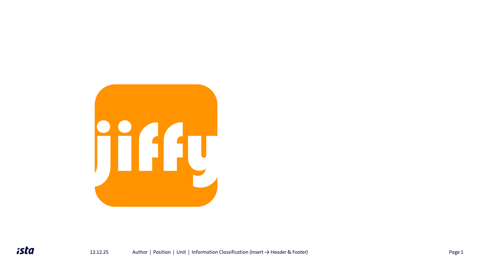

# Jiffy - Algebraic Effects for Java



Jiffy is a lightweight library that brings algebraic effects to Java with compile-time effect checking through annotations.

## Features

- 🔍 **Compile-time effect checking** - Catch missing effect declarations during compilation
- 📝 **Annotation-based** - Use familiar Java annotations to declare effects
- 🎯 **Type-safe** - Effects are visible in method signatures
- 🔧 **Extensible** - Easy to add new effects and handlers
- 🏗️ **Spring-friendly** - Integrates well with Spring Boot applications
- ⚡ **Minimal overhead** - Efficient runtime with direct handler dispatch
- 🧪 **Multiple execution modes** - Sync, async, traced, and dry-run

## Demo Project

This demo shows how to use jiffy in a SpringBoot application.
It also has a nice introduction to core concepts used:

https://github.com/thma/jiffy-clean-architecture/

## Quick Start

### Define an Effect

```java
public sealed interface LogEffect extends Effect<Void> {
    record Info(String message) implements LogEffect {}
    record Error(String message) implements LogEffect {}
}
```

### Use Effects in Your Code

```java
import org.jiffy.annotations.Uses;
import org.jiffy.core.Eff;

public class UserService {

    @Uses({LogEffect.class, DatabaseEffect.class})
    public Eff<User> findUser(Long id) {
        return Eff.perform(new LogEffect.Info("Finding user " + id))
            .flatMap(ignored ->
                Eff.perform(new DatabaseEffect.Query("SELECT * FROM users WHERE id = " + id))
            )
            .map(result -> parseUser(result));
    }
}
```

### Handle Effects

```java
public class LogHandler implements EffectHandler<LogEffect> {
    @Override
    public <T> T handle(LogEffect effect) {
        switch (effect) {
            case LogEffect.Info(var message) -> System.out.println("[INFO] " + message);
            case LogEffect.Error(var message) -> System.err.println("[ERROR] " + message);
        }
        return null;  // LogEffect returns Void
    }
}
```

### Run with Runtime

```java
EffectRuntime runtime = EffectRuntime.builder()
    .withHandler(LogEffect.class, new LogHandler())
    .withHandler(DatabaseEffect.class, new DatabaseHandler())
    .build();

// Execute the program
User user = runtime.run(findUser(123L));
```

## Compile-Time Checking

The annotation processor validates that all effects used in a method are declared:

```java
@Uses({LogEffect.class})  // Missing DatabaseEffect!
public Eff<User> findUser(Long id) {
    return Eff.perform(new DatabaseEffect.Query("..."))  // Compile error!
        .map(this::parseUser);
}
```

## Installation

### Maven

```xml
<dependency>
    <groupId>org.jiffy</groupId>
    <artifactId>jiffy</artifactId>
    <version>1.0.0-SNAPSHOT</version>
</dependency>
```

### Gradle

```gradle
implementation 'org.jiffy:jiffy:1.0.0-SNAPSHOT'
```

## Core Concepts

### Effects
Effects represent side effects as data. They extend the `Effect<T>` interface where `T` is the return type.

### Eff Monad
`Eff<T>` is a monadic type that represents a computation that may perform effects and produce a value of type `T`. It is a **pure data structure** describing *what* to do, not *how* to do it.

### Effect Handlers
Handlers interpret effects. They implement `EffectHandler<E>` where `E` is the effect type.

### EffectRuntime
The runtime holds registered handlers and provides methods to execute `Eff` programs:

```java
EffectRuntime runtime = EffectRuntime.builder()
    .withHandler(LogEffect.class, logHandler)
    .withHandler(DatabaseEffect.class, dbHandler)
    .build();
```

### Annotations
- `@Uses` - Declares which effects a method may use
- `@Pure` - Marks methods as effect-free

## Execution Modes

Jiffy provides multiple ways to execute effect programs:

### Synchronous Execution

```java
// Direct execution
User user = runtime.run(findUser(123L));
```

### Asynchronous Execution

```java
// Returns immediately with a CompletableFuture
CompletableFuture<User> future = runtime.runAsync(findUser(123L));

// Compose multiple async operations
CompletableFuture<Report> report = runtime.runAsync(fetchUser(id))
    .thenCombine(runtime.runAsync(fetchOrders(id)), this::generateReport);
```

### Traced Execution

Capture all effects performed during execution for debugging, testing, or auditing:

```java
Traced<User> traced = runtime.runTraced(findUser(123L));

// Access the result
User user = traced.result();

// Inspect the effect log
System.out.println("Effects performed: " + traced.effectCount());
traced.effectLog().forEach(System.out::println);

// Query specific effect types
if (traced.hasEffect(DatabaseEffect.Query.class)) {
    List<DatabaseEffect.Query> queries = traced.getEffects(DatabaseEffect.Query.class);
    System.out.println("Database queries: " + queries.size());
}
```

### Dry Run (Static Analysis)

Inspect effects without executing them:

```java
List<Effect<?>> effects = runtime.dryRun(findUser(123L));
System.out.println("This program would perform: " + effects);
```

### Fluent API with prepare()

For a more fluent style at the "edge of the world":

```java
// Prepare returns a RunnableEff with multiple execution options
RunnableEff<User> prepared = runtime.prepare(findUser(123L));

User user = prepared.run();                    // sync
CompletableFuture<User> future = prepared.runAsync();  // async
Traced<User> traced = prepared.runTraced();    // traced
List<Effect<?>> effects = prepared.dryRun();   // dry run
```

## Advanced Features

### For Comprehensions

Scala-style for comprehensions for composing multiple effects:

```java
Eff<CustomerReport> report = Eff.For(
    perform(new LogEffect.Info("Generating report")),
    perform(new DatabaseEffect.FindCustomer(customerId)),
    perform(new DatabaseEffect.FindOrders(customerId))
).yield((log, customer, orders) ->
    new CustomerReport(customer, orders)
);
```

### Parallel Effects

```java
Eff.parallel(
    fetchUserData(userId),
    fetchUserOrders(userId)
).map(pair -> new UserProfile(pair.getFirst(), pair.getSecond()));
```

### Effect Recovery

```java
// Simple recovery with a fallback value
fetchData()
    .recover(error -> defaultData());

// Recovery with logging (using recoverWith for proper effect handling)
fetchData()
    .recoverWith(error ->
        Eff.perform(new LogEffect.Error("Failed: " + error.getMessage()))
            .map(v -> defaultData())
    );
```

### Sequential Composition

```java
Eff.andThen(
    validateInput(data),
    saveToDatabase(data),
    notifyUser(userId)
);
```

## Architecture

Jiffy follows a clean separation between effect description and interpretation:

```
┌─────────────────────────────────────────────────────────┐
│                    Your Application                      │
│                                                          │
│  ┌──────────────┐    ┌──────────────┐    ┌───────────┐  │
│  │   Effects    │    │  Eff<T>      │    │ @Uses     │  │
│  │   (Data)     │───▶│  (Program)   │◀───│ @Pure     │  │
│  └──────────────┘    └──────────────┘    └───────────┘  │
│                             │                            │
└─────────────────────────────│────────────────────────────┘
                              │
                              ▼
┌─────────────────────────────────────────────────────────┐
│                    EffectRuntime                         │
│                                                          │
│  ┌──────────────┐    ┌──────────────┐    ┌───────────┐  │
│  │  Handlers    │    │ Interpreter  │    │ Execution │  │
│  │              │◀───│ (pattern     │───▶│ Modes     │  │
│  │              │    │  matching)   │    │           │  │
│  └──────────────┘    └──────────────┘    └───────────┘  │
│                                                          │
│  run() | runAsync() | runTraced() | dryRun() | prepare()│
└─────────────────────────────────────────────────────────┘
```

## Building from Source

```bash
git clone https://github.com/yourusername/jiffy.git
cd jiffy
mvn clean install
```

## Contributing

Contributions are welcome! Please open an issue or submit a pull request.

## License

This project is licensed under the Apache 2.0 License - see the [LICENSE](LICENSE) file for details.

## Acknowledgments

- Inspired by algebraic effects in Haskell and OCaml
- Similar projects: [Jeff](https://github.com/lpld/jeff)
- Built for the Java community with ❤️
